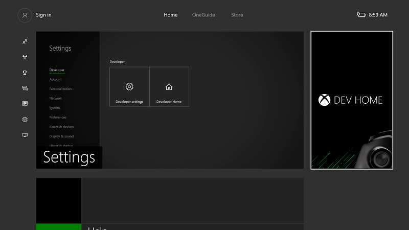
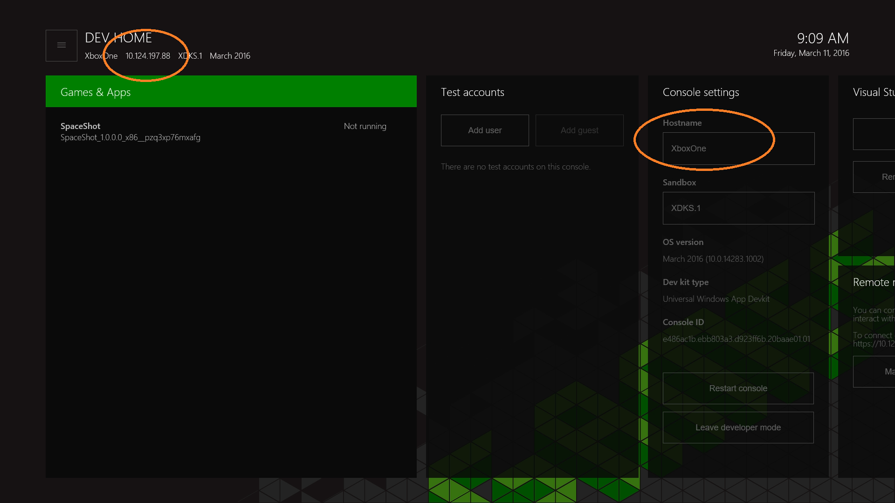
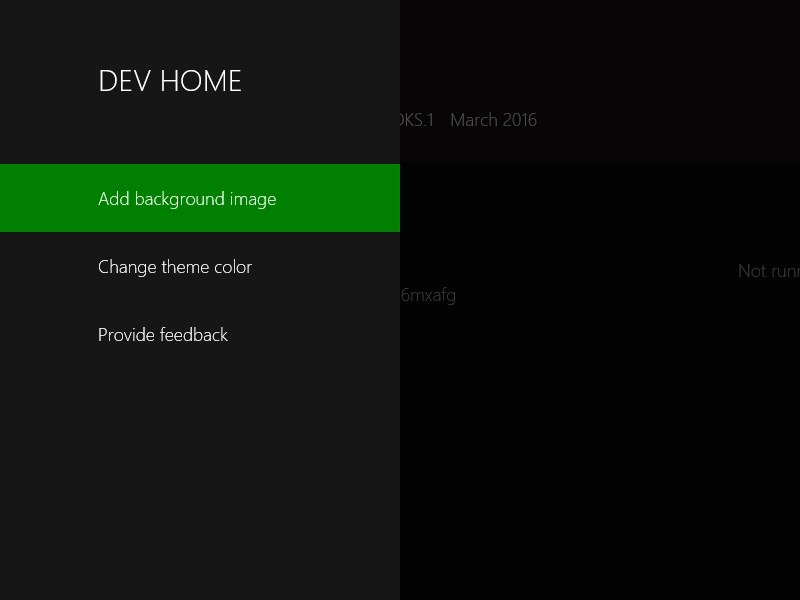

# Introdução às ferramentas do Xbox One

Esta seção aborda a ferramenta _Dev Home_ específica ao Xbox One usando o Windows Device Portal

## Dev Home

A _Dev Home_ é uma experiência de ferramentas no Xbox One Development Kit criada para auxiliar na produtividade do desenvolvedor. A Dev Home oferece funcionalidade para gerenciar e configurar o kit de desenvolvimento.

Para abrir a Dev Home, selecione o bloco **Dev Home** na tela inicial. Se não houver nenhum bloco presente, o console não estará no modo de desenvolvedor.

  

### Interface do usuário
A interface do usuário Dev Home é dividida em áreas descritas nas seções a seguir. Observe que o endereço IP do console e o nome amigável são exibidos aqui.

  

#### Cabeçalho
O cabeçalho contém informações importantes "em um relance" sobre o kit de desenvolvimento. Isso inclui o nome do console, seu endereço IP, a área restrita do Xbox Live na qual ele se encontra e a versão do sistema operacional que ele está executando. À direita do cabeçalho, a data e hora atual do sistema é mostrada por conveniência.

#### Janelas da ferramenta
Sob o cabeçalho está a área principal do aplicativo que contém um conjunto de janelas de ferramentas configuráveis. Elas têm o objetivo de permitir que os desenvolvedores personalizem o aplicativo para fornecer acesso a várias ferramentas e conjuntos de informações. Para obter mais detalhes sobre as ferramentas, consulte as descrições de cada ferramenta a seguir. Para obter informações sobre como configurar o layout e a aparência das janelas da ferramenta, consulte a seção [Personalizando a Dev Home](#customizing-dev-home) posteriormente nesta página.

##### Menu principal
Pressionando o botão **Menu** em seu controlador ou navegando para o botão ("Hambúrguer") do menu na parte superior esquerda da tela, você pode acessar o menu principal que permite que você configure a cor do tema e a imagem de plano de fundo do espaço de trabalho do aplicativo e fornecer comentários sobre o aplicativo.

  

#### Modo de ajuste
As ferramentas da Dev Home podem ser ajustadas para o lado enquanto você estiver executando seu título para que você possa ter acesso fácil às ferramentas enquanto está testando.

Para acessar o modo **Ajuste**, selecione o título da ferramenta apropriada, pressione o botão **Exibir** em seu controlador e, no menu de contexto, selecione **Ajuste**.

  

A Dev Home será ajustada à direita. Você pode alternar o contexto tocando duas vezes no botão **Nexus** como de costume.

  

##### Descrições das ferramentas
| Ferramenta  | Recursos |
|-------|--------------|
| Jogos e aplicativos  | Lista os títulos e os aplicativos instalados no kit de desenvolvimento e a capacidade de abri-los rapidamente. Você também pode exibir o estado do PLM (Gerenciamento do Tempo de Vida do Processo) de jogos e aplicativos e alterar os estados do PLM de um menu de contexto. |
| Usuários | Lista os usuários registrados atualmente no console. Habilita a entrada de um clique de entrada/saída do usuário, adicionando os usuários e convidados e exibindo detalhes de usuários e convidados. |
| [Configurações do console](#console-settings) | Fornece uma exibição "em um relance" e as opções de edição das configurações e informações do console. |
| Visual Studio | Permite que você emparelhe o console com uma instância do Visual Studio para permitir a implantação. Se necessário, desmarque as instâncias emparelhadas existentes do VS para evitar a implantação do aplicativo UWP em um kit. |
| [Windows Device Portal](#windows-device-portal) | Habilita o WDP (uma ferramenta de gerenciamento de dispositivos baseada em navegador) no kit. |
| Status do Xbox Live | Fornece o status atual do serviço Xbox Live. |

### Personalizando a Dev Home

A Dev Home foi projetada para ser personalizável e pessoal. Você pode escolher uma cor de tema e uma imagem de plano de fundo para personalizar sua experiência da Dev Home. Essas opções estão localizadas no menu principal.

#### Redimensionando e reordenando ferramentas
Para alterar o tamanho ou a posição de uma ferramenta, use o botão de menu de contexto (botão **Exibir** em seu controlador) enquanto o foco está no título. No menu de contexto, selecione **Mover** ou **Redimensionar**.

  

#### Alterando a cor do tema e a imagem do plano de fundo
No menu principal, você pode selecionar **Alterar a cor do tema**. Para atualizar a cor do tema usada para realçar o foco, selecione uma nova cor e clique em **Salvar**.

  

### Fornecendo comentários
Para fornecer comentários sobre a Dev Home ou qualquer um dos processos de ferramentas, selecione a opção **Fornecer comentários** no menu principal.

  

## Configurações do console
A ferramenta de configurações do Console fornece acesso rápido às configurações do kit de desenvolvimento.

### Definindo um nome de host para o console
Ao se comunicar com o console em seu PC de desenvolvimento, você pode definir um nome amigável (chamado de _hostname_) para o kit de desenvolvimento do Xbox One usar como alternativa ao endereço IP do console. Seu PC de desenvolvimento e o kit de desenvolvimento devem estar na mesma sub-rede para que a conectividade do nome de host funcione.  

Para definir um nome de host para um kit de desenvolvimento, vá para a ferramenta de configurações do Console e digite o nome do host na caixa __Hostname__.  

  > **Observação**
            &nbsp;&nbsp;A exclusividade do nome não é aplicada quando o nome do host é criado. Tenha cuidado para evitar duplicação de nomes. Uma maneira de fazer isso é derivar o nome do host do nome de seu computador de desenvolvimento, que é exclusivo dentro de uma organização.

## Windows Device Portal
O Windows Device Portal (WDP) é uma ferramenta de gerenciamento de dispositivos do OneCore que permite uma experiência de gerenciamento de dispositivos baseada em navegador.

Para habilitar o WDP no console do Xbox One:

1. Selecione o bloco Dev Home na tela inicial.

  

2. Dentro da Dev Home, navegue até a ferramenta **Gerenciamento remoto**.

  

3. Selecione __Gerenciar o Windows Device Portal__ e pressione __A__.
4. Selecione a caixa de seleção __Habilitar Windows Device Portal__.
5. Insira um __Nome de usuário__ e __Senha__ e salve-os. Esses são usados para autenticar o acesso ao kit de desenvolvimento em um navegador.
6. Feche a página __Configurações__ e observe a URL listada na ferramenta _Gerenciamento remoto_ a conectar.
7. Insira a URL em seu navegador e entre com as credenciais que você configurou.
8. Você receberá um aviso sobre o certificado que foi fornecido, semelhante à captura de tela a seguir, porque o certificado de segurança assinado por seu console do Xbox One não é considerado um publicador confiável conhecido. Clique em **Continuar para este site** para acessar o Windows Device Portal.

  

## Veja também
- [Tecnologias Microsoft Developer: Windows Device Portal](https://ms-iot.github.io/content/en-US/win10/tools/DevicePortal.htm)
- [UWP no Xbox One](index.md)

----

<!--HONumber=Jun16_HO3-->

